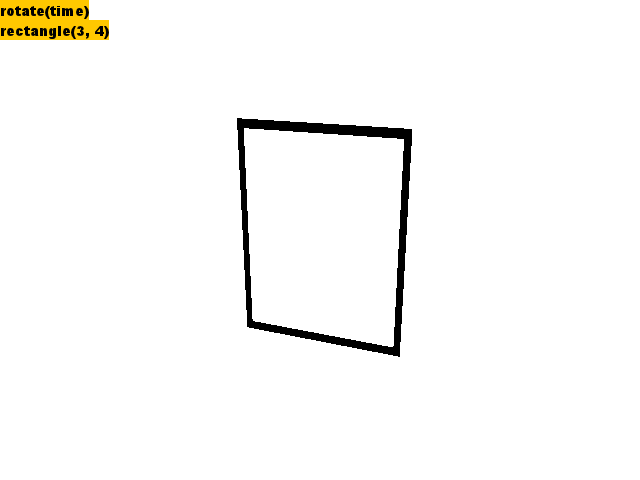
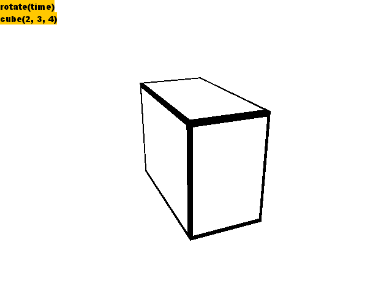
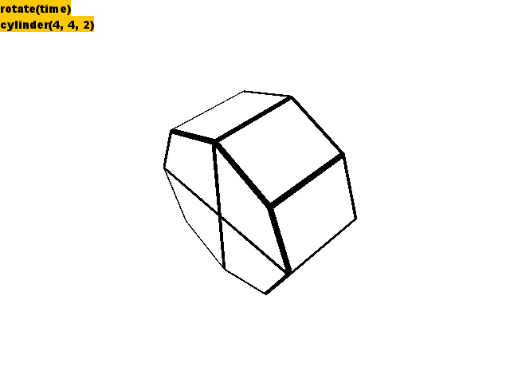
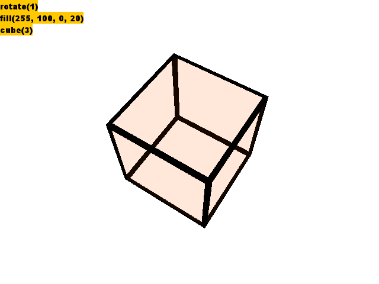
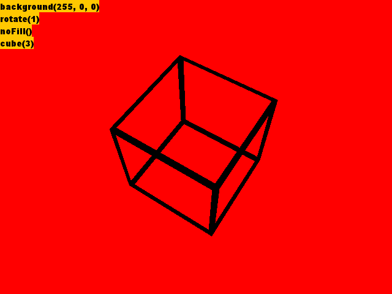
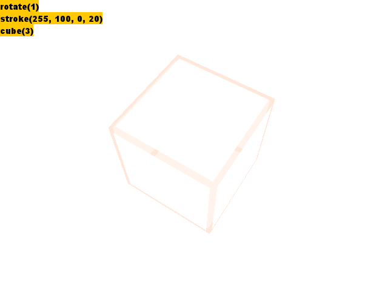

l# Reference

This is a reference of all the built-in functions and variables available in Improviz.

## Shapes

There are five basic shape functions, all of which take between one and three arguments which determine the size of the shape. :-

### line

```
line(3)
```

Draws a line on the screen with width and depth equal to a single pixel.
Can be given a single value which can set the line length, but will otherwise default to `1`.


### rectangle

```
rectangle(3, 4)
```

Draws a rectangle to the screen with a width and height, but a depth of only a single pixel.
Can be given up to two arguments to set the width and height.
Will default to `1` for each if no value is given.
If a single value is given then that will be used for both the width and height.
If two arguments are given then they will set the width and height separately.



### cube

```
cube(1, 2, 3)
```

Draws a cube to the screen.
Can be given up to three arguments to set the width, height, and depth.
Will default to `1` for each if no value is given.
If a single value is given then that will be used for all three dimensions.
If two arguments are given then the first will set the width, and the second will set the height and depth.
If three arguments are given then they will set the width, height, and depth separately.



### sphere

```
sphere(3, 4, 1)
```

Draws a sphere to the screen.
Can be given up to three arguments to set the width, height, and depth.
Will default to `1` for each if no value is given.
If a single value is given then that will be used for all three dimensions.
If two arguments are given then the first will set the width, and the second will set the height and depth.
If three arguments are given then they will set the width, height, and depth separately.


### cylinder

```
cylinder(2, 2, 1)
```

Draws a cylinder to the screen.
Can be given up to three arguments to set the width, height, and depth.
Will default to `1` for each if no value is given.
If a single value is given then that will be used for all three dimensions.
If two arguments are given then the first will set the width, and the second will set the height and depth.
If three arguments are given then they will set the width, height, and depth separately.



### shape

```
shape(:cylinder, 2, 2, 2)
shape(:line, 3)
shape(:cube, 2) // will cause an error
```

All the above functions are actually implemented using the `shape` function.
The first value given needs to be a symbol that specifies which shape to draw, with the remaining arguments being the shape's dimensions.
If a value is not given for a required dimension then an error will occur.


## Styles

These functions can all be used to change the style that a shape is drawn with. Primarily the colours of the faces or edges, but also setting textures on the shape.

With the exception of `style`, all the rest of the style functions support [blocks](./language.md#function-blocks) which can be used to limit their style changes to only those shapes created within the block.

### fill

```
fill(255, 100, 0, 20)
cube(3)
```

Sets the colour that the faces of the shape will be drawn with.
When given four arguments, these correspond to the red, green, blue and alpha components of the desired colour.
The arguments need to be within a range of `0` to `255`.
If no arguments are given then they will all default to `255`.
If a single value is given then this will be used for the red, green and blue components, with alpha being `255`.
If two arguments are given then the first will be used for the red and blue components, with the second being the green component, and alpha being `255`.
If three arguments are given then these will be used for the red, green, and blue components and alpha being `255`.



### noFill

```
background(255, 0, 0)
noFill()
cube(3)
```

Sets the face colour to be fully transparent.
Does not take any arguments.



### stroke

```
stroke(255, 100, 0, 20)
cube(3)
```

Sets the colour that the edges of the shape will be drawn with.
When given four arguments, these correspond to the red, green, blue and alpha components of the desired colour.
The arguments need to be within a range of `0` to `255`.
If no arguments are given then they will all default to `255`.
If a single value is given then this will be used for the red, green and blue components, with alpha being `255`.
If two arguments are given then the first will be used for the red and blue components, with the second being the green component, and alpha being `255`.
If three arguments are given then these will be used for the red, green, and blue components and alpha being `255`.



### strokeSize

```
strokeSize(0.3)
sphere(3)
```

Sets the line thickness of the stroke when drawing a shape. The default is 0.02. Currently a value of 0.5 will cause the stroke to cover the entire face of a shape.


### noStroke

```
background(255, 0, 0)
noStroke()
cube(3)
```

Sets the edge colour to be fully transparent.
Does not take any arguments.


### texture

```
texture(:code)
cube(3)
texture(:diagsquares, time % frames(:diagsquares))
sphere(2)
```

Sets an image to be used as a texture on the shape.
The first value must be a symbol that either matches the name of a texture or is the special named `:code`.
If the `:code` symbol is used, then the text of the current code that Improviz is running will be rendered to the shape as a texture and will update as the code changes.
The optional second value selects a given frame from an animated texture to be used. If the second value given is greater than the number of frames then no texture will be displayed.

### material

```
material(:ceed)
	cube(3)
```

Selects the material to use when rendering shapes.

### animate

```
animate(:hand1, 2)
cylinder(3)
```

Simplifies the animation of textures.
The first value must be a symbol that either matches the name of a texture or is the special named `:code`.
If the `:code` symbol is used, then the text of the current code that Improviz is running will be rendered to the shape as a texture and will update as the code changes.
The optional second value controls the playback speed of the animated texture loop.

### style

```
style(:noFill)
cube(3)
style(:fill, 255, 0, 255, 30)
sphere(2)
```

All the above functions are actually implemented using the `style` function.
The first value given needs to be a symbol that specifies which style to use, with the remaining arguments being the styles arguments.
If a value is not given for a required argument then an error will occur.

## Transformations

These functions can all be used to change the dimensions or position that a shape is drawn with.

With the exception of `matrix`, all the rest of the transformation functions support [blocks](./language.md#function-blocks) which can be used to limit their changes to only those shapes created within the block.

### rotate

```
rotate(2)
cube()
rotate()
cylinder()
```

Rotates the shape on the x, y, and z axes.
When given three arguments, these correspond to the radian angle of rotation in each of the axes.
If no arguments are given then the rotation will be in the x and the y axes by an amount dependant on the current time, meaning it will be animated.
If a single value is given then this will be used for the x and y axis rotations, with the z axis not being rotated at all.
If two arguments are given then the first will be used for the x axis rotation, the second will be used for the y rotation, with the z axis not being rotated at all.

### scale

```
scale(2)
cube()
scale()
cylinder()
```

Changes the size of the shape on the x, y, and z axes.
When given three arguments, these correspond to the size scaling in each of the axes.
If no arguments are given then the scaling will be in the x and the y axes by an amount dependant on the current time, meaning it will be animated.
If a single value is given then this will be used for the scaling on all axes.
If two arguments are given then the first will be used for the x and y axis scaling, the second will be used for the z axis scaling.

### move

```
move(1, 1, 0)
cube()
move()
cylinder()
```

Changes the position of the shape on the x, y, and z axes.
When given three arguments, these correspond to the movement amount in each of the axes.
If no arguments are given then the movement will be in all three axes by an amount dependant on the current time, meaning it will be animated.
If a single value is given then this will be used for the movement in the x axis, with no movement in the others.
If two arguments are given then the first will be used for the x movement, the second for the y axis movement, with no change in the z axis.

### matrix

```
matrix(:rotate, 2, time, 2)
cube(2)
```

All the above functions are actually implemented using the `matrix` function.
The first value given needs to be a symbol that specifies which matrix transformation to draw, with the remaining arguments being the transformation's dimensions.
If a value is not given for a required axis then an error will occur.


## Global

The global functions change general things about the Improviz environment. Specifically the background colour and the animation style.

### background

```
background(255, 100, 0)
cube(3)
```

Sets the colour of the screen's background.
When given three arguments, these correspond to the red, green and blue components of the desired colour.
The arguments need to be within a range of `0` to `255`.
If no arguments are given then they will all default to `255`.
If a single value is given then this will be used for the red, green and blue components.
If two arguments are given then the first will be used for the red component, with the second being the green component, with the blue being `255`.

### motionBlur

```
motionBlur()
rotate()
cube()
```

Adds a motion blur effect to the frame when drawn. If this is followed by other animation style function calls then this will be ignored.

### paintOver

```
paintOver()
rotate()
cube()
```

Adds a paint over effect to the frame when drawn. If this is followed by other animation style function calls then this will be ignored.

### animationStyle

```
animationStyle(:normal)
rotate()
cube()
```

Sets the animation style to use when drawing the frame. If this is followed by other animation style function calls then this will be ignored.
Takes a single argument which is a symbol specifying the animation style. Can be any of the following,

* `:normal`
* `:motionBlur`
* `:paintOver`

## Math

There are a number of mathematical functions available for manipulating numbers.

* sin
* cos
* tan
* abs
* ceil
* floor
* round
* max
* min
* log
* sqrt

## Scope Handling

Improviz allows saving the current style and transformation settings so that they can be returned to later. This can be used to make sure that specific changes only affect the chosen shapes.

### pushScope

```
noFill()
pushScope()
rotate()
cube(2)
popScope()
cube()
```

Save the current style and transformation state on a stack.

### popScope

```
noFill()
pushScope()
rotate()
cube(2)
popScope()
cube()
```

Return to the previously saved style and transformation state.

## Utility

The utility functions have specific uses that don't really fit into another category.

### isNull

```
func example(size)
	if (isNull(size))
		cube(0.1)
	else
		cube(size)
```

Can be used to check if a variable is `null`.
Most useful within functions to check argument values.

### ext

```
size = ext(:size, 2)
cube(size)
```

Used to get the value of an external variable, which could have been set via an OSC or HTTP message.
The first argument is the name of the variable to get.
The second is a default value.

### frames

```
texture(:hand1, time % frames(:hand1))
sphere(2)
```

Get the number of frames available for a texture.
Primarily used when animating textures.

### length

```
sizes = [1,2,3,2+2]
s = sizes[(time * 4) % length(sizes)]

rotate(time)
cube(s)
```

Get the length of a list.

### random

```
rotate(time)
cube(random())
```

Generate a random number between zero and one. The seed value is set at the beginning of every frame, meaning that multiple calls to random within a frame will give different numbers, but the series of calls in different frames will give the same series of numbers.

### randomSeed

```
randomSeed 234

rotate(time)
cube(random())
```

Set the seed used to generate all the random numbers in a frame. The local time is used to set this when Improviz starts up.

### depthCheck

```
depthCheck(0)

loop 10 times
	rotate(time/3)
	cube(4)
```

Disable depth checking.

### debug

```
myvar = 56
debug(1, myvar, :symbol, time)
```

The debug function will print out to the terminal the value of all the arguments it's been given. This will result in a lot of text, as it's likely the function will be called every frame, but this may still be useful for figuring out what's happening in some of your code.
